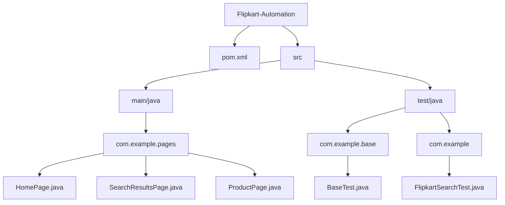
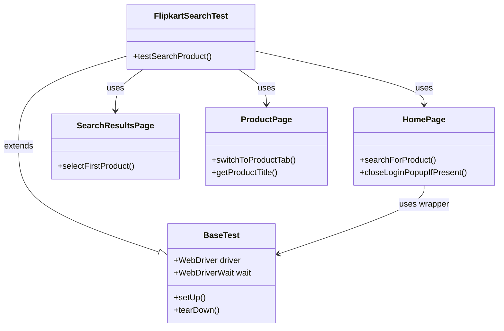
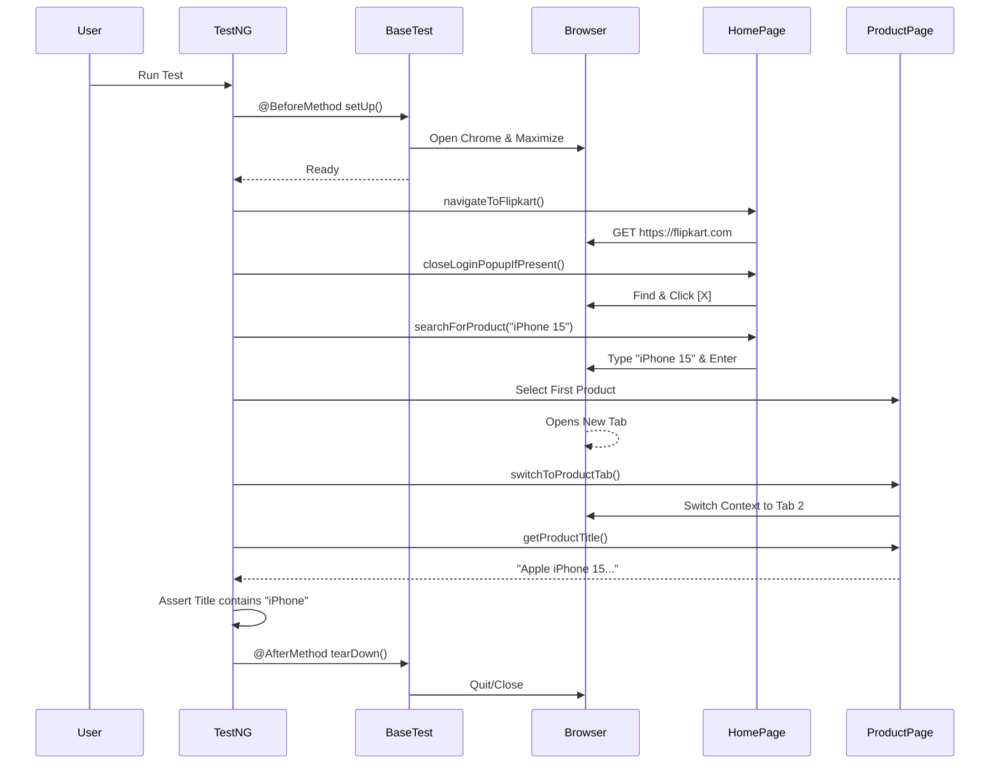

# Flipkart Automation Framework - Project Documentation

## 📋 Table of Contents
1. [Project Overview](#-project-overview)
2. [Project Structure](#-project-structure)
3. [Dependencies](#-dependencies)
4. [Framework Architecture](#-framework-architecture)
5. [In-Depth: How It Works](#-in-depth-how-it-works)
    - [BaseTest: The Foundation](#basetest-the-foundation)
    - [Page Object Model Implementation](#page-object-model-implementation)
    - [Robust Locator Strategies](#robust-locator-strategies)
    - [Window & Tab Handling](#window--tab-handling)
6. [Test Execution Flow](#-test-execution-flow)
7. [Running Tests](#-running-tests)
8. [Configuration Guide](#-configuration-guide)
9. [Troubleshooting & Common Issues](#-troubleshooting--common-issues)
10. [Extension Guide](#-extension-guide)

---

## 🎯 Project Overview

This is a **Selenium-based automation framework** for testing Flipkart's search functionality. It is designed to be scalable, maintainable, and robust against UI changes.

**Key Technical Features:**
- **Design Pattern:** Page Object Model (POM) for clean separation of concerns.
- **Testing Framework:** TestNG for test lifecycle management and assertions.
- **Build Tool:** Maven for dependency management and test execution.
- **Wait Strategy:** Combination of implicit waits (global) and explicit waits (action-specific) for stability.
- **Dynamic Elements:** Handling of dynamic popups and new window creation.

---

## 📁 Project Structure



### File Responsibilities
- **`pom.xml`**: Managing dependencies (Selenium, TestNG) and build plugins.
- **`BaseTest.java`**: Handles `WebDriver` initialization (`@BeforeMethod`) and cleanup (`@AfterMethod`).
- **`HomePage.java`**: Logic for searching, login popups.
- **`SearchResultsPage.java`**: Complex logic to find product tiles reliably.
- **`ProductPage.java`**: Validation logic and tab switching.
- **`FlipkartSearchTest.java`**: The actual test script connecting all pages.

---

## 📦 Dependencies

Managed via Maven in `pom.xml`.

| Dependency | Artifact ID | Version | Description |
|------------|-------------|---------|-------------|
| **Selenium** | `selenium-java` | `4.25.0` | **Core Automation Library.** <br> • Controls the browser (Chrome).<br> • Uses `Selenium Manager` to automatically download the correct ChromeDriver version matching your installed browser.<br> • Provides `WebDriverWait` for synchronization. |
| **TestNG** | `testng` | `7.9.0` | **Testing Framework.**<br> • `@Test`: Marks methods as tests.<br> • `@BeforeMethod`: Setup before *each* test.<br> • `@AfterMethod`: Teardown after *each* test.<br> • `Assert`: Validates test results. |
| **Compiler Plugin** | `maven-compiler-plugin` | `3.11.0` | Compiles Java code. configured for **Java 17**. |
| **Surefire Plugin** | `maven-surefire-plugin` | `3.2.5` | Executes tests during `mvn test`. Scans for files ending in `Test.java`. |

---

## 🏗️ Framework Architecture

We use the **Page Object Model (POM)**. This separates the *Test Layer* (Validation) from the *Page Layer* (Interaction).



---

## ⚙ In-Depth: How It Works

### BaseTest: The Foundation
Located at `src/test/java/com/example/base/BaseTest.java`.

- **Driver Initialization:**
  ```java
  driver = new ChromeDriver(); // Starts Chrome
  driver.manage().window().maximize(); // Maximizes for visibility
  driver.manage().timeouts().implicitlyWait(Duration.ofSeconds(5)); // Global wait
  ```
- **Implicit Wait:** A backup wait. If an element isn't found contextually, Selenium waits up to 5 seconds before failing.

### Page Object Model Implementation

Each page class (`HomePage`, `ProductPage`) contains:
1.  **WebDriver reference:** Passed via constructor.
2.  **Locators:** `By` strategies defined as private fields.
3.  **Methods:** Public actions (e.g., `clickLogin()`, `enterText()`).

### Robust Locator Strategies
In `SearchResultsPage.java`, we use a fail-safe strategy for finding products because Flipkart often changes class names.

```java
// Logic: Try finding by specific class first...
try {
    wait.until(ExpectedConditions.visibilityOfElementLocated(productTitles));
    // click...
} catch (Exception e) {
    // ...if that fails, try finding by text content!
    By fallback = By.xpath("//div[contains(text(), 'iPhone') ...]");
    driver.findElement(fallback).click();
}
```
**Why?** This prevents "flaky" tests that break simply because a developer changed a CSS class.

### Window & Tab Handling
When you click a product on Flipkart, it opens a **new tab**. Selenium stays on the **old tab** by default.
We explicitly switch focus in `ProductPage.java`:

```java
public void switchToProductTab() {
    String currentHandle = driver.getWindowHandle();
    Set<String> allHandles = driver.getWindowHandles();
    
    for (String handle : allHandles) {
        if (!handle.equals(currentHandle)) {
            driver.switchTo().window(handle); // Switch to the new tab
            break;
        }
    }
}
```

---

## 🔄 Test Execution Flow



---

## 🚀 Running Tests

### 1. Command Line (Maven)
This is how CI/CD pipelines run the test.
```bash
# Run the specific test class
mvn test -Dtest=FlipkartSearchTest

# Run all tests in the project
mvn clean test
```

### 2. IDE (IntelliJ / Eclipse)
- Open `src/test/java/com/example/FlipkartSearchTest.java`
- Click the green **Run** triangle icon next to the class name or `@Test` annotation.
- Select **Run 'testSearchProduct'**.

---

## 🔧 Configuration Guide

### `pom.xml` Settings

- **Java Version:** Changing `<maven.compiler.source>17</maven.compiler.source>` allows you to use newer Java features.
- **Selenium Version:** Update `<version>4.25.0</version>` inside dependencies to upgrade Selenium.

### Timeouts
- **Global Timeout:** Change `Duration.ofSeconds(5)` in `BaseTest.java`.
- **Explicit Timeout:** Change `Duration.ofSeconds(10)` in Page Object constructors.

---

## ❓ Troubleshooting & Common Issues

| Issue | Cause | Solution |
|-------|-------|----------|
| **`SessionNotCreatedException`** | Chrome browser version mismatch with driver. | Run `mvn clean` or update Selenium version in `pom.xml`. Selenium Manager usually fixes this automatically. |
| **`NoSuchElementException`** | Element locators changed or page didn't load. | Check the locator XPath in the Page Class. Increase wait time if your internet is slow. |
| **`StaleElementReferenceException`** | The DOM updated after you found the element but before you clicked it. | Re-find the element inside the method before using it. |
| **Login Popup not closing** | Flipkart sometimes doesn't show the popup. | The code handles this with `try-catch`. If it fails, check if the Close button locator (`X`) changed. |

---

## 🔌 Extension Guide

### How to Add a New Test
1. **Create a new Test Class** in `src/test/java/com/example/`.
2. **Extend `BaseTest`** to get free setup/teardown.
3. **Write `@Test` method**.

### How to Add a New Page
1. Create a class in `src/main/java/com/example/pages/`.
2. Define `By` locators for elements on that page.
3. Create methods for user actions (Click, Type, Read Text).

```java
// Example: CartPage.java
public class CartPage {
    private WebDriver driver;
    private By checkoutBtn = By.cssSelector("button.checkout");

    public CartPage(WebDriver driver) { this.driver = driver; }

    public void proceedToCheckout() {
        driver.findElement(checkoutBtn).click();
    }
}
```
