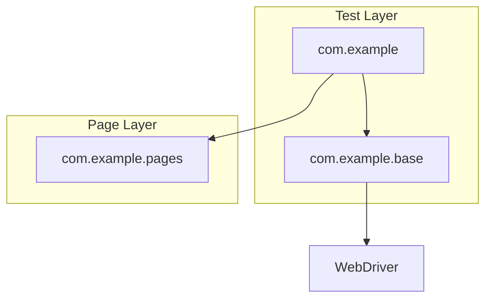

# 🛒 Flipkart Automation Framework

[](https://www.oracle.com/java/)
[](https://www.selenium.dev/)
[](https://testng.org/)
[](https://maven.apache.org/)

---

## 📖 Overview

A high-performance, robust **Selenium-based automation framework** specifically designed for Flipkart. This project leverages the **Page Object Model (POM)** to ensure modularity, readability, and ease of maintenance for large-scale e-commerce testing suites.

## ✨ Core Features

*   **Modular Architecture**: Implements Page Object Model (POM) for clean separation of test scripts and page-specific logic.
*   **Intelligent Waits**: Combines implicit and explicit waits to handle asynchronous UI updates and lazy loading gracefully.
*   **Dynamic Tab Management**: Seamless context switching between search results and product detail pages.
*   **Fail-Safe Locators**: Uses multi-layered XPath/CSS strategies to mitigate flakiness caused by dynamic UI changes.
*   **Automated Driver Management**: Powered by Selenium Manager for zero-configuration browser setup.

## 🏗️ Project Architecture



## 🚀 Getting Started

### Prerequisites
*   **JDK 17** or higher
*   **Apache Maven** 3.8+
*   **Google Chrome**

### Quick Start
1.  **Clone the Repository**
    ```bash
    git clone https://github.com/dyannadle/Flipkart-Automation.git
    cd Flipkart-Automation
    ```
2.  **Run All Tests**
    ```bash
    mvn clean test
    ```

## 🛠️ Configuration
Timeouts and browser settings can be tuned in:
*   `src/test/java/com/example/base/BaseTest.java` (Global Timeouts)
*   `pom.xml` (Dependency and Compiler versions)

## 📜 Documentation
For detailed insights into specific page implementations and troubleshooting common Selenium issues, see the [Full Project Documentation](PROJECT_DOCUMENTATION.md).

---
Developed & Maintained by **[Deepak Yannadle](https://github.com/dyannadle)**
